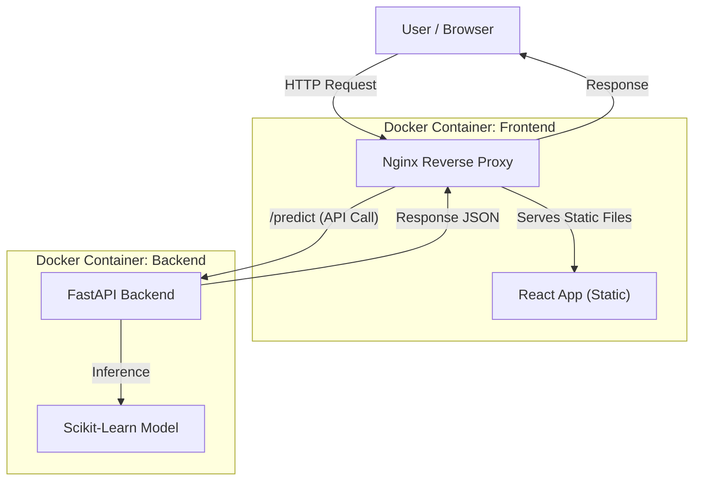

# Text Classification System 


## Project Description
This project implements an end-to-end web application for automatic news classification, designed to assist news portal editors in quickly categorizing incoming articles.

The system uses Natural Language Processing (NLP) to classify articles into four categories: **World, Sports, Business, and Sci/Tech**. It features a modern React frontend, a high-performance FastAPI backend, and is fully containerized for easy deployment.

### Key Features
- **Single Text Classification:** Real-time prediction with confidence scores.
- **Batch Processing:** Support for classifying multiple headlines at once (one per line).
- **CSV Export:** Download batch results directly to CSV.
- **Model Transparency:** Dedicated information page displaying model metrics and details.
- **Responsive Design:** Built with Material UI for usage on desktop and mobile.

---

## Solution Architecture

The application follows a containerized microservices pattern. The architecture ensures separation of concerns and production readiness using a Reverse Proxy.



**Data Flow:**

1. **Client:** The user interacts with the React interface.
2. **Proxy:** Nginx receives all requests on port 80.
* Static requests (`/`, `/index.html`) are served locally.
* API requests (`/predict`, `/model`) are forwarded internally to the Backend container.


3. **Inference:** FastAPI validates the input using Pydantic and passes the text to the ML Pipeline.
4. **Response:** The prediction (Category + Confidence) is returned to the client.

---

## Technical Decisions & Justifications

### 1. Machine Learning: TF-IDF + Naive Bayes

* **Decision:** I chose a classical ML approach over Deep Learning (Transformers/BERT).
* **Justification:** The AG News dataset is relatively simple. Naive Bayes offers fast inference and low memory usage, while still achieving ~90% accuracy.

### 2. Backend: FastAPI + Pydantic

* **Decision:** Usage of FastAPI instead of Flask or Django.
* **Justification:** FastAPI provides asynchronous capabilities (ASGI), automatic data validation with Pydantic schemas, and auto-generated Swagger documentation. This ensures error handling and type safety.

### 3. Frontend: React + Material UI

* **Decision:** Component-based architecture with a UI library.
* **Justification:** React allows for clean state management. Material UI was selected to ensure a responsive, accessible, and modern design without writing custom CSS from scratch, speeding up development.

### 4. Infrastructure: Nginx Reverse Proxy

* **Decision:** Placing Nginx in front of the application components.
* **Justification:** This solves **CORS (Cross-Origin Resource Sharing)** issues by unifying the origin. It also prepares the application for production, as Nginx is efficient at serving static files than Python or Node.js servers.

---

## ML Model Metrics

The model was evaluated on a held-out test set of 7,600 samples from the AG News dataset.

| Metric | Score |
| --- | --- |
| **Overall Accuracy** | **89.67%** |
| **Macro F1-Score** | **0.90** |

**Class-wise Performance:**

| Category | Precision | Recall | F1-Score |
| --- | --- | --- | --- |
| World | 0.91 | 0.89 | 0.90 |
| Sports | 0.95 | 0.98 | 0.96 |
| Business | 0.87 | 0.85 | 0.86 |
| Sci/Tech | 0.87 | 0.87 | 0.87 |

---

## How to Run

You can run the application using **Docker (Recommended)** or manually.

### Option A: Docker (Production-like)

This method spins up the Backend, Frontend, and Nginx proxy automatically.

1. Ensure Docker Desktop is running.
2. Run the command:
```bash
docker compose up --build

```


3. Access the application:
* **Frontend:** [http://localhost](http://localhost)
* **API Docs:** [http://localhost:8000/docs](http://localhost:8000/docs)


### Option B: Manual Setup (Development)

**1. Backend Setup**

```bash
cd backend
python3 -m venv .venv
source .venv/bin/activate  # On Windows: .venv\Scripts\activate
pip install -r requirements.txt
uvicorn app.main:app --reload
# Backend runs on http://127.0.0.1:8000

```

**2. Frontend Setup**

```bash
cd frontend
npm install
npm run dev
# Frontend runs on http://localhost:5173

```

---

## Possible Future Improvements

If given more time, the following features would be implemented:

1. **ML Ops:** Implement a Model Registry (e.g., MLflow) to manage model versions dynamically instead of loading a static `.pkl` file.
2. **Database Integration:** Connect a PostgreSQL database to store user feedback and flagged misclassifications for future retraining (Human-in-the-loop).
3. **Advanced NLP:** Experiment with a DistilBERT model to potentially improve accuracy on the "Business" category (currently the lowest F1-score).
4. **Testing:** Add Unit Tests (Pytest) for the API and E2E Tests (Cypress) for the Frontend.
5. **CI/CD:** Setup a GitHub Actions pipeline to automate testing and deployment.

---

## Project Structure

```text
test-rapidcanvas/
├── backend/
│   ├── app/
│   │   ├── main.py          # App entrypoint
│   │   ├── services/        # ML inference logic & error handling
│   │   ├── routers/         # API endpoints
│   │   └── models/          # Pydantic Schemas
│   ├── model/               # Serialized .pkl model
│   ├── notebooks/           # Training and analysis notebooks
│   └── Dockerfile
├── frontend/
│   ├── src/
│   │   ├── components/      # React components (Single, Batch, Info)
│   │   └── api.js           # Axios configuration
│   ├── nginx.conf           # Reverse proxy config
│   └── Dockerfile
└── docker-compose.yml       # Orchestration

```

```